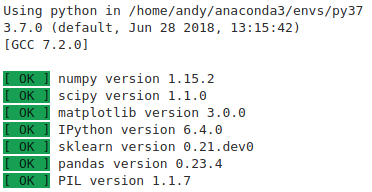

# Recommendation Systems in Python
========================================================

Contents
-----------
- [Part 1: Getting Started](https://github.com/jbernhard-nw/rec-workshop/tree/master/Part%201%20-%20Getting%20Started)
- [Part 2: What data should I use?](https://github.com/jbernhard-nw/rec-workshop/tree/master/Part%202%20-%20Data%20Sources)
- [Part 3: How do I find relevant recommendations?](https://github.com/jbernhard-nw/rec-workshop/tree/master/Part%203%20-%20Recommendation%20Systems)
- [Part 4: How do I know if my recommendations are good?](https://github.com/jbernhard-nw/rec-workshop/tree/master/Part%204%20-%20Evaluation)

Instructor
-----------

- [Joshua Bernhard](https://www.linkedin.com/in/joshuabernhard/) My career can be described as educating others, and then educating myself to ensure that how I am educating others is relevant.

**Teaching Experience:** Iowa State University, University of Colorado, Galvanize, Udacity, General Assembly

**Industry Experience:** Championship Productions, Clovis Oncology, KPMG, NerdWallet

About the workshop
------------------
Recommendations are everywhere.  Netflix wants to recommend you movies and shows you will watch.  Stitch Fix wants to recommend you clothes you will wear.  NerdWallet wants to recommend you financial products that will improve your life and that you will be approved for, Tinder wants to recommend you a significant other, and Amazon wants to recommend you... well everything.  In this workshop, we will take a look at what should be considered when building your own recommendation system and how you can get started building your own recommendation systems using Python.

Prerequisites
-------------
This workshop assumes familiarity with Jupyter notebooks and basics of pandas, matplotlib and numpy.


Obtaining the Tutorial Material
--------------------------------


If you are familiar with git, it is most convenient if you clone the GitHub repository. This
is highly encouraged as it allows you to easily synchronize any changes to the material.

```
git clone https://github.com/jbernhard-nw/rec-workshop.git
```

If you are not familiar with git, you can download the repository as a .zip file by heading over to the GitHub repository (https://github.com/jbernhard-nw/rec-workshop) in your browser and click the green “Download” button in the upper right.


Please note that I may add and improve the material until shortly before the tutorial session, and we recommend you to update your copy of the materials one day before the tutorials. If you have a GitHub account and forked/cloned the repository via GitHub, you can sync your existing fork with via the following commands:

```
git pull origin master
```

Installation Notes
------------------

This tutorial will require recent installations of

- [NumPy](http://www.numpy.org)
- [SciPy](http://www.scipy.org)
- [matplotlib](http://matplotlib.org)
- [pandas](http://pandas.pydata.org)
- [turicreate](https://github.com/apple/turicreate)
- [scikit-learn](http://scikit-learn.org/stable/) (>=0.22.1)
- [IPython](http://ipython.readthedocs.org/en/stable/)
- [Jupyter Notebook](http://jupyter.org)

The last one is important, you should be able to type:

    jupyter notebook

in your terminal window and see the notebook panel load in your web browser.
Try opening and running a notebook from the material to see check that it works.

For users who do not yet have these  packages installed, a relatively painless way to install all the requirements is to use a Python distribution
such as [Anaconda](https://www.continuum.io/downloads), which includes
the most relevant Python packages for science, math, engineering, and
data analysis; Anaconda can be downloaded and installed for free
including commercial use and redistribution.
The code examples in this tutorial require Python 3.5 or later.

After obtaining the material, we **strongly recommend** you to open and execute
a Jupyter Notebook `jupyter notebook check_env.ipynb` that is located at the
top level of this repository. Inside the repository, you can open the notebook
by executing

```bash
jupyter notebook check_env.ipynb
```

inside this repository. Inside the Notebook, you can run the code cell by
clicking on the "Run Cells" button as illustrated in the figure below:


Finally, if your environment satisfies the requirements for the tutorials, the executed code cell will produce an output message as shown below:



References
-----------

* [TuriCreate Documentation](https://apple.github.io/turicreate/docs/userguide/recommender/)
* [Hybrid Recommender Systems: Survey and Experiments](https://www.researchgate.net/publication/263377228_Hybrid_Recommender_Systems_Survey_and_Experiments)
* [Alexandra Coman's Lecture Notes](http://www.cse.lehigh.edu/~munoz/CSE335/classes/ComanRecommender.pdf)
* [Practical Recommender Systems](https://www.amazon.com/Practical-Recommender-Systems-Kim-Falk/dp/1617292702)
* [Recommender Systems](https://www.amazon.com/Recommender-Systems-Textbook-Charu-Aggarwal-ebook/dp/B01DK3GZDY)
* [Baptiste Rocca's Introduction to recommender systems](https://towardsdatascience.com/introduction-to-recommender-systems-6c66cf15ada)
* [MovieTweetings Data](https://github.com/sidooms/MovieTweetings/tree/master/latest)
* [FunkSVD](https://sifter.org/~simon/journal/20061211.html)
* [Scraping Resources Using Selenium](https://github.com/AnnaVM/Project_Plotline/tree/master/code)
* [Text Cleaning Using Tf-Idf](https://kavita-ganesan.com/extracting-keywords-from-text-tfidf/#.XksamxNKhTY)
* [StackOverflow](https://stackoverflow.com/)
* [Google](google.com)
* [GIPHS](https://giphy.com/)
* [Andreas Mueller's course](https://github.com/amueller/ml-workshop-1-of-4/) was used as a template for the overall layout of this workshop.  You will see certain installations and overall patterns are similar between our repositories.
